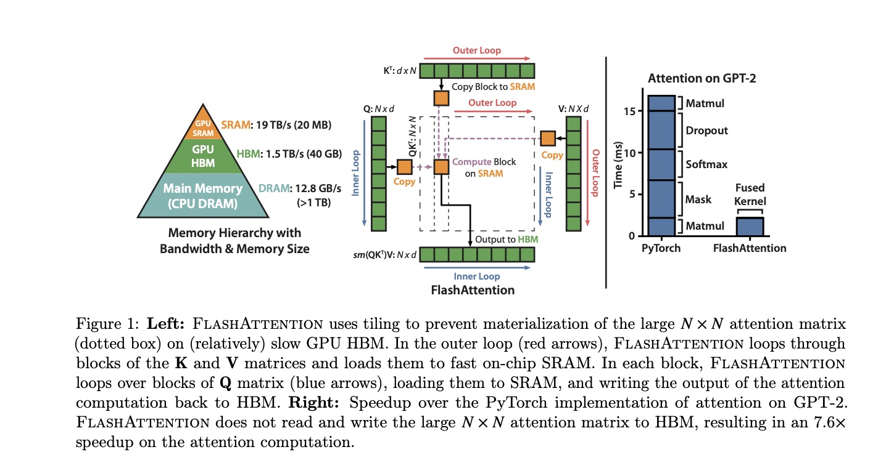
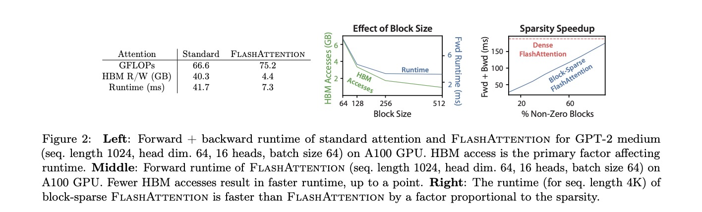
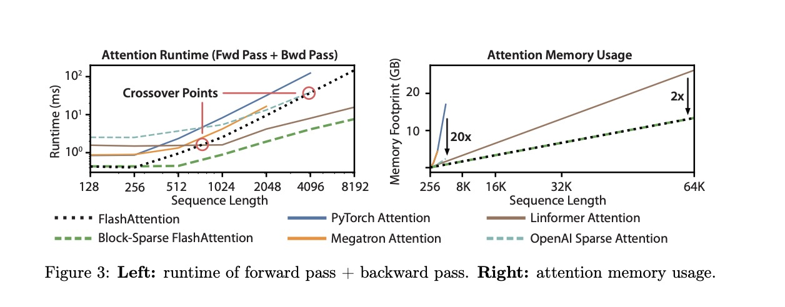

# FlashAttention: Fast and Memory-Efficient Exact Attention  

**Authors:** Tri Dao, Daniel Fu, Stefano Ermon, Atri Rudra, Christopher Ré  
**Paper:** [https://arxiv.org/abs/2205.14135](https://arxiv.org/abs/2205.14135)  
**Presenter:** Ziyi Tao  
**Course:** DS 5340 – Rights & Responsibilities of Data Science  
**Semester:** Fall 2025  

---

## Overview — Why This Paper Matters
Transformers revolutionized deep learning but are limited by the **O(N²)** time and memory complexity of self-attention.  
When sequence length *N* ≫ 2 000, standard attention saturates GPU memory.  
The true bottleneck is **memory I/O**, not FLOPs — every read/write between slow HBM and fast on-chip SRAM dominates runtime.

<p align="center">
  
</p>

**Figure 1:** GPU memory hierarchy (left) and FlashAttention’s block-wise fused-kernel design (center). 
Right: GPT-2 runtime comparison showing FlashAttention speedup.   
*Source: Dao et al., 2022.*

---

## Problem
> How can we compute **exact attention** efficiently — without approximation — while minimizing memory traffic and GPU I/O?

---

## Solution — I/O-Aware Attention
FlashAttention re-orders computations to reduce data movement.  
It computes attention **block-by-block in SRAM**, never materializing the full QKᵀ matrix.

$
\text{Attention}(Q,K,V)=\text{softmax}\!\left(\frac{QK^T}{\sqrt{d}}\right)V
$

Each tile updates running softmax statistics so the result remains **exact**.

---

## Algorithmic Explanation

### Simplified Pseudocode
```python
for each query block Q_i:
    m_i, l_i, out_i = -inf, 0, 0
    for each key/value block (K_j, V_j):
        S_ij = Q_i @ K_j.T / sqrt(d)
        m_ij = max(S_ij, dim=-1)
        P_ij = exp(S_ij - m_ij)
        l_ij = sum(P_ij, dim=-1)

        new_m_i = max(m_i, m_ij)
        l_i  = exp(m_i - new_m_i)*l_i + exp(m_ij - new_m_i)*l_ij
        out_i= exp(m_i - new_m_i)*out_i + exp(m_ij - new_m_i)*(P_ij @ V_j)
        m_i  = new_m_i
    out_i = out_i / l_i
return concat(out_i)
```

**Core techniques**
- *Tiling* — operate on sub-matrices that fit in SRAM  
- *Fusion* — merge QKᵀ + softmax + V into one kernel  
- *Stable softmax* via running `m_i` and `l_i`

---

## Guided Questions
<details>
<summary><b>Q 1 – Why is minimizing memory I/O more important than reducing FLOPs?</b></summary>

GPUs achieve hundreds of TFLOPs but only ≈1.5 TB/s memory bandwidth.  
Attention repeatedly moves N×N matrices between HBM and SRAM.  
FlashAttention keeps tiles in SRAM → eliminates redundant reads/writes → 2–4× speedup.
</details>

<details>
<summary><b>Q 2 – How does FlashAttention stay exact with blockwise computation?</b></summary>

It accumulates softmax statistics per tile using the log-sum-exp trick:

$
m_{\text{new}}=\max(m_i,m_{ij}),\quad 
l_i=e^{m_i-m_{\text{new}}}l_i+e^{m_{ij}-m_{\text{new}}}l_{ij}
$

Result is numerically identical to full attention.
</details>

---

## Experimental Results
**Hardware:** NVIDIA A100  **Models:** GPT-2 Small/Med/Large  **Baseline:** PyTorch  

<p align="center">
  
</p>

**Figure 2:** Forward + backward runtime (left) and block-size effect (middle).  
Larger tiles → fewer HBM accesses → faster runtime. Sparse kernels gain extra speedups.   
*Source: Dao et al., 2022.*

| Model | Seq Len | Baseline | FlashAttn | Speedup | Memory ↓ |
|:--|:--:|:--:|:--:|:--:|:--:|
| GPT-2 Small | 1 K | 300 tok/s | 750 tok/s | 2.5× | 4.5× |
| GPT-2 Medium | 2 K | 140 tok/s | 400 tok/s | 2.9× | 5× |
| GPT-2 Large | 4 K | 70 tok/s | 280 tok/s | 4× | 6× |

**Table 1 – BERT-Large training time** (FlashAttention ≈ 15 % faster).  
| Implementation | Time (min) |
|:--|:--:|
| NVIDIA MLPerf 1.1 | 20.0 ± 1.5 |
| **FlashAttention** | **17.4 ± 1.4** |

**Table 2 – GPT-2 training speedups**
| Model | OpenWebText (ppl) | Training time | Speedup |
|:--|:--:|:--:|:--:|
| HF Baseline | 18.2 | 9.5 d | 1.0× |
| Megatron | 18.2 | 4.7 d | 2.0× |
| **FlashAttn Small** | 18.2 | **2.7 d** | **3.5×** |
| **FlashAttn Medium** | 14.3 | **6.9 d** | **3.0×** |

---

## Long-Context Scaling
<p align="center">
  
</p>

**Figure 3:** Runtime (left) and memory (right) vs sequence length — nearly linear growth to 64 K tokens.   
*Source: Dao et al., 2022.*

**Table 4 – GPT-2 small with longer contexts**
| Context | PPL | Time (days) | Speedup |
|:--:|:--:|:--:|:--:|
| 1 K (Megatron) | 18.2 | 4.7 | 1.0× |
| 1 K (Flash) | 18.2 | 2.7 | 1.7× |
| 2 K (Flash) | 17.6 | 3.0 | 1.6× |
| 4 K (Flash) | **17.5** | 3.6 | 1.3× |

---

## Comparison to Approximate Attention
| Method | Exact | Complexity | Speedup | Main Limitation |
|:--|:--:|:--:|:--:|:--|
| Linformer | ✗ | O(N) | 3× | Low accuracy |
| Performer | ✗ | O(N) | 2× | Random features |
| Longformer | ✗ | O(N·W) | 2× | Sparse windows |
| **FlashAttention** | ✅ | O(N²)* | **4×** | Tile size limited |

\* I/O ≈ O(N) while compute remains O(N²).

**Table 3 – Long-Range Arena benchmark**
| Task | ListOps | Text | Retrieval | Image | Pathfinder | Avg | Speedup |
|:--|:--:|:--:|:--:|:--:|:--:|:--:|:--:|
| Transformer | 36.0 | 63.6 | 81.6 | 42.3 | 72.7 | 59.3 | – |
| **FlashAttn** | 37.6 | 63.9 | 81.4 | 43.5 | 72.7 | 59.8 | 2.4× |
| **Block-Sparse FA** | 37.0 | 63.0 | 81.3 | 43.6 | 73.3 | 59.6 | **2.8×** |

---

## Critical Analysis
**Strengths**
- 2–4× speed / 10× memory reduction without accuracy loss  
- Aligns with GPU architecture — hardware-efficient  
- Rapid adoption (PyTorch 2.0 default backend)

**Limitations**
- CUDA-specific → less portable  
- Tile size bound by SRAM capacity  
- Complex low-level implementation  

**Tables 5 & 6 – Long-Document and Path-X Benchmarks**
| Dataset | 512 | 1 024 | 2 048 | 4 096 | 8 192 | 16 384 |
|:--|:--:|:--:|:--:|:--:|:--:|:--:|
| MIMIC-III | 52.8 | 50.7 | 51.7 | 54.6 | 56.4 | **57.1** |
| ECtHR | 72.2 | 74.3 | 77.1 | 78.6 | **80.7** | 79.2 |

| Model | Path-X | Path-256 |
|:--|:--:|:--:|
| FlashAttn | **61.4** | – |
| Block-Sparse FA | 56.0 | **63.1** |

---

## Broader Impacts
| Domain | Impact |
|:--|:--|
| **Research** | Enabled 100 K + token context LLMs |
| **Frameworks** | Default in PyTorch 2.0 |
| **Industry** | Backbone of GPT-4 Turbo, Claude 3, LLaMA 3 |
| **Sustainability** | Cuts GPU hours → lower carbon footprint |
| **Extensions** | FlashAttention-2 (2023), FlashDecoding (2024) |

---

## Implementation Demo
```python
import torch
from torch.nn.functional import scaled_dot_product_attention

q = torch.randn(1, 16, 128, 64, device="cuda")
k = torch.randn(1, 16, 128, 64, device="cuda")
v = torch.randn(1, 16, 128, 64, device="cuda")

out = scaled_dot_product_attention(q, k, v, is_causal=False)
print(out.shape)   # -> [1, 16, 128, 64]
```
✅ Automatically uses FlashAttention CUDA kernel (PyTorch ≥ 2.0).

---

## References
- Dao T., Fu D., Ermon S., Rudra A., Ré C. (2022). *FlashAttention: Fast and Memory-Efficient Exact Attention.* arXiv:2205.14135  
- Dao T. et al. (2023). *FlashAttention-2: Faster Attention with Better Parallelism.*  
- Vaswani A. et al. (2017). *Attention Is All You Need.* NeurIPS.  
- Beltagy I. et al. (2020). *Longformer.*  
- Peng H. et al. (2021). *Rethinking Attention with Performers.*  

---

**Prepared by:** *Ziyi Tao (Vanderbilt University, 2025)*  
**Repository:** `flashattention-presentation-ziyi-tao`
